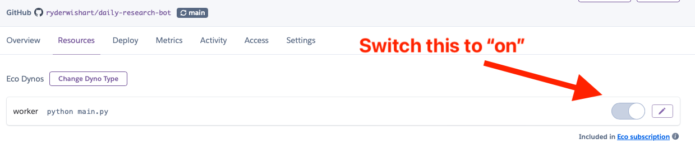

# Daily Research Bot

Daily Research Bot is an AI-powered Discord bot that helps you stay on top of new AI-related research, with a focus on low-resource language translation tasks. It summarizes recent papers from sources like Hugging Face and Elvis Saravia's blog, providing concise insights and potential applications.

## Features

- Fetches and summarizes recent AI papers daily
- Provides concise summaries focusing on core insights and potential applications
- Supports interactive querying of paper summaries
- Uses long-term memory (PostgreSQL with pgvector) for efficient similarity search
- Customizable system prompt for tailored responses

## Setup

### Prerequisites

- Python 3.7+
- PostgreSQL database with pgvector extension
- Discord account and bot token
- OpenAI API key

### Installation

1. Clone the repository:
   ```
   git clone https://github.com/yourusername/daily-research-bot.git
   cd daily-research-bot
   ```

2. Install dependencies:
   ```
   pip install -r requirements.txt
   ```

3. Set up your PostgreSQL database with pgvector:
   ```sql
   CREATE EXTENSION vector;
   CREATE TABLE summaries (
       id SERIAL PRIMARY KEY,
       title TEXT,
       snippet TEXT,
       link TEXT,
       embedding VECTOR(1536)
   );
   ```

   > [Note] The `VECTOR(1536)` type is a 1536-dimensional vector. The `vector` extension provides support for storing and querying vectors in PostgreSQL. This is the size of the OpenAI embedding model, but if you used a different embedding model, you'll need to adjust the dimensions accordingly.

4. Create a `.env` file in the project root with the following content:
   ```
   DISCORD_BOT_TOKEN=your_discord_bot_token
   OPENAI_API_KEY=your_openai_api_key
   DB_HOST=your_db_host
   DB_DATABASE=your_db_name
   DB_USER=your_db_user
   DB_PASSWORD=your_db_password
   DB_PORT=your_db_port
   ```

### Running the Bot Locally

1. Start the bot:
   ```
   python main.py
   ```

2. To run an immediate indexing of papers, use:
   ```
   python main.py --index_now
   ```

## Usage

- Mention the bot in a Discord channel along with keywords "summarize", "papers", or "recent research" to get summaries of recent papers.
- Ask the bot any question, and it will provide context-aware responses based on the stored paper summaries.

## Customization

1. Modify the `bot_instructions` file to change the system prompt and adjust the bot's behavior.
2. Update the `get_huggingface_papers` and `get_elvissaravia_papers` functions in `main.py` to add or modify paper sources.
3. Adjust the `summarize_papers_in_batches` function to change the batch size or summary format.

## Deployment on Heroku

1. Create a new app on Heroku.
2. Add the Heroku Postgres add-on to your app.
3. In your Heroku app dashboard, go to the "Deploy" tab.
4. Under "Deployment method", select "GitHub" and connect to your repository.
5. Enable automatic deploys from your main branch (or preferred branch).
6. Set up the following environment variables in the "Settings" tab under "Config Vars":
   - `DISCORD_BOT_TOKEN`
   - `OPENAI_API_KEY`
   - `DATABASE_URL` (This should be automatically set by the Heroku Postgres add-on)
7. Ensure your `Procfile` is in the root directory of your project and contains:
   ```
   web: python main.py
   ```
8. Deploy your app manually from the "Deploy" tab or push to your connected GitHub repository.

### Setting up pgvector on Heroku Postgres

After deploying, you need to set up pgvector on your Heroku Postgres database:

1. Connect to your Heroku Postgres database using `psql` or the Heroku CLI.
2. Run the following SQL commands:
   ```sql
   CREATE EXTENSION vector;
   CREATE TABLE summaries (
       id SERIAL PRIMARY KEY,
       title TEXT,
       snippet TEXT,
       link TEXT,
       embedding VECTOR(1536)
   );
   ```

Your Discord bot should now be up and running with long-term memory capabilities on Heroku!

## Contributing

Contributions are welcome! Please feel free to submit a Pull Request.

## License

This project is licensed under the MIT License - see the LICENSE file for details.

## Credits

- [OpenAI](https://openai.com) for the embedding model.
- [pgvector](https://github.com/pgvector/pgvector) for the vector extension.
- [Discord](https://discord.com) for the chat platform.
- [Hugging Face](https://huggingface.co) for the AI research papers.
- [Elvis Saravia](https://elvis.io) for the AI research papers.

I post notes at [ryder.dev](https://ryder.dev)
X: [@ryderwishart](https://x.com/ryderwishart)

## Troubleshooting

### pgvector-related Issues

If you encounter errors related to pgvector or vector operations, ensure that:

1. The pgvector extension is properly installed in your PostgreSQL database.
2. The `summaries` table is created with the correct schema, including the `embedding VECTOR(1536)` column.
3. The vector dimensions in your code match the dimensions in your database schema (1536 in this case).

If you're still having issues, try manually casting the embedding to a vector in your queries:

### Heroku Deployment Issues

Make sure you have the right resource dyno, namely a `worker` type, not a `web` type.

You might have to switch this on manually in the Heroku dashboard:


